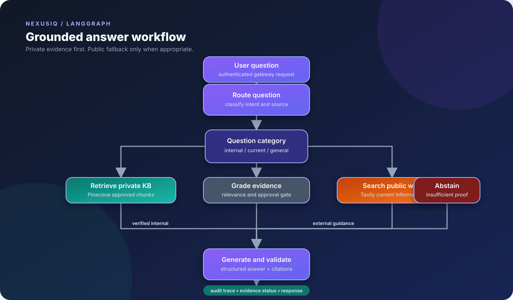
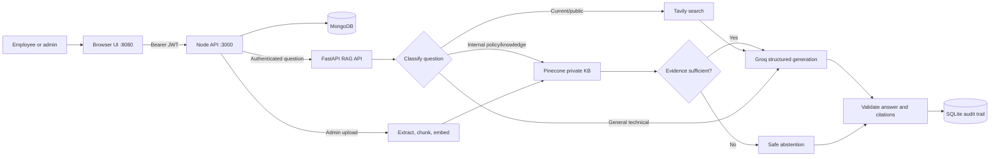

# NexusIQ — Enterprise IT Support Agentic RAG

NexusIQ is a secure enterprise IT support copilot that combines an
authenticated web workspace with an agentic Retrieval-Augmented Generation
(RAG) pipeline. Employees can ask questions about company systems and
policies; administrators can upload approved source documents; and every
answer exposes its evidence status, source type, citations, and workflow
trace.

This workspace contains the complete application:

| Component | Location | Default port | Responsibility |
| --- | --- | ---: | --- |
| Python RAG service | [`Agentic-RAG/`](./Agentic-RAG/) | `8080` | FastAPI, browser UI, LangGraph, ingestion, retrieval, audit, evaluation |
| Node backend | [`Agentic-RAG Backend/`](./Agentic-RAG%20Backend/) | `3000` | Express API, MongoDB, JWT authentication, roles, gateway |
| Supporting material | [`Agentic-RAG/docs/`](./Agentic-RAG/docs/) | — | Problem statement and project reference documents |

## Product workflow



The workflow image shows the implemented LangGraph path: classify the request,
prefer approved internal evidence, use public search only for current external
information, abstain when internal evidence is insufficient, and validate the
final answer and citations.



### Answer modes

| Source mode | Behavior |
| --- | --- |
| `private_kb` | Uses approved internal documents from Pinecone and returns internal citations |
| `web_search` | Uses Tavily for current/public information and labels the result external |
| `direct` | Answers general technical questions without claiming company policy |
| `insufficient_evidence` | Refuses to invent internal policy and directs the user to approved IT support |

The agent uses a conservative evidence gate: vector similarity is not treated
as proof, retrieved chunks are de-duplicated, and only documents marked
`source_type=internal` and `approved=true` may support a verified internal
answer.

## Main capabilities

- Employee registration and login with bcrypt password hashing.
- JWT-based sessions with `employee` and `admin` roles.
- Admin-only upload of PDF, TXT, Markdown, and DOCX documents.
- 25 MB gateway upload limit and extension allow-list.
- Recursive document chunking with 900-character chunks and 120-character overlap.
- Gemini embeddings stored in Pinecone.
- Groq structured answer generation.
- Tavily fallback for current public information.
- Pydantic response validation and citations.
- Privacy-aware SQLite audit records.
- Optional LangSmith tracing and evaluation.
- Responsive browser workspace with chat, workflow trace, source status,
  document upload, and theme controls.

## Repository structure

```text
Enterprise IT Agentic RAG/
├── README.MD
├── Agentic-RAG/
│   ├── app/
│   │   ├── api/                 # FastAPI routes
│   │   ├── core/                # Settings, logging, observability
│   │   ├── evaluation/          # Dataset and evaluators
│   │   ├── rag/                 # LangGraph workflow and Pinecone store
│   │   └── services/            # Ingestion and SQLite audit
│   ├── data/sample_kb/          # Example internal knowledge base
│   ├── scripts/                 # Dataset and evaluation commands
│   ├── static/                  # Browser JavaScript and CSS
│   ├── templates/               # Jinja UI template
│   ├── tests/                   # Python tests
│   ├── Dockerfile
│   ├── .env.example
│   ├── requirements.txt
└── Agentic-RAG Backend/
    ├── src/
    │   ├── routes/              # Auth, questions, documents
    │   ├── middleware/          # JWT and role checks
    │   ├── server.js
    │   ├── config.js
    │   └── db.js
    ├── .env.example
    ├── package.json
    └── package-lock.json
```

## Prerequisites

- Python **3.11**.
- Node.js **18 or newer**.
- MongoDB.
- Pinecone account and API key.
- Google API key for Gemini embeddings.
- Groq API key for answer generation.
- Tavily API key for current/public questions.
- Optional LangSmith API key for tracing and evaluation.

## Quick start on Windows

### 1. Configure the Python service

```powershell
cd "D:\Enterprise IT Agentic RAG\Agentic-RAG"
py -3.11 -m venv myenv
.\myenv\Scripts\Activate.ps1
pip install -r requirements.txt
Copy-Item .env.example .env
```

Set the provider and Pinecone credentials in `.env`. At minimum, configure
`GROQ_API_KEY`, `GOOGLE_API_KEY`, `PINECONE_API_KEY`, and `ADMIN_API_KEY`.

### 2. Configure and start the Node backend

Start MongoDB, then:

```powershell
cd "D:\Enterprise IT Agentic RAG\Agentic-RAG Backend"
Copy-Item .env.example .env
npm install
npm run dev
```

Set `MONGODB_URI`, `JWT_SECRET`, `RAG_ADMIN_API_KEY`, `ADMIN_EMAIL`, and
`ADMIN_PASSWORD`. `RAG_ADMIN_API_KEY` must match the Python service's
`ADMIN_API_KEY`.

### 3. Start the Python service

```powershell
cd "D:\Enterprise IT Agentic RAG\Agentic-RAG"
.\myenv\Scripts\python.exe run.py
```

Open [`http://127.0.0.1:8080`](http://127.0.0.1:8080). The Python UI calls
the Node API at `BACKEND_API_URL`, which defaults to
`http://127.0.0.1:3000`.

### 4. Index the sample knowledge base

```powershell
.\myenv\Scripts\python.exe ingest_sample_kb.py
```

This loads the sample files in `Agentic-RAG/data/sample_kb/`, chunks them,
creates embeddings, and writes vectors to the configured Pinecone namespace.

## Configuration overview

### Python `.env`

The full template is [`Agentic-RAG/.env.example`](./Agentic-RAG/.env.example).
Important variables include:

- `GROQ_API_KEY`, `GROQ_MODEL`
- `GOOGLE_API_KEY`, `EMBEDDING_MODEL`
- `TAVILY_API_KEY`
- `PINECONE_API_KEY`, `PINECONE_INDEX_NAME`, `PINECONE_NAMESPACE`
- `ADMIN_API_KEY`, `BACKEND_API_URL`
- `LANGSMITH_TRACING`, `LANGSMITH_API_KEY`, `LANGSMITH_PROJECT`
- `OBSERVABILITY_REDACT_INPUTS` and `OBSERVABILITY_REDACT_RETRIEVED_TEXT`

### Node `.env`

The full template is
[`Agentic-RAG Backend/.env.example`](./Agentic-RAG%20Backend/.env.example).
Important variables include:

- `PORT`
- `MONGODB_URI`, `MONGODB_DB`
- `JWT_SECRET`, `JWT_EXPIRES_IN`
- `RAG_API_URL`, `RAG_ADMIN_API_KEY`
- `ADMIN_EMAIL`, `ADMIN_PASSWORD`
- `CLIENT_ORIGIN`

Never commit populated `.env` files or reuse development secrets in production.

## API surface

### Node backend

| Method | Route | Access | Purpose |
| --- | --- | --- | --- |
| `GET` | `/health` | Public | Backend health |
| `POST` | `/api/auth/register` | Public | Register employee |
| `POST` | `/api/auth/login` | Public | Issue JWT |
| `GET` | `/api/auth/me` | JWT | Current user |
| `GET` | `/api/documents` | JWT | Document metadata |
| `POST` | `/api/documents` | Admin JWT | Upload and index document |
| `POST` | `/api/questions` | JWT | Ask the RAG service |

### Python RAG service

| Method | Route | Access | Purpose |
| --- | --- | --- | --- |
| `GET` | `/` | Public | Browser application |
| `GET` | `/api/health` | Public | RAG health |
| `POST` | `/api/chat` | Gateway-facing | Run LangGraph |
| `POST` | `/api/ingest` | `X-Admin-Key` | Ingest a document |

Protected gateway requests use:

```http
Authorization: Bearer <jwt>
```

The browser upload uses multipart form data with a `file` field. Chat bodies
use `{ "question": "..." }`; questions must contain 2–3000 characters.

## Testing and evaluation

Run Python tests:

```powershell
cd "D:\Enterprise IT Agentic RAG\Agentic-RAG"
.\myenv\Scripts\python.exe -m pytest
```

Run Node syntax checks:

```powershell
cd "D:\Enterprise IT Agentic RAG\Agentic-RAG Backend"
npm run check
```

Optional LangSmith commands:

```powershell
cd "D:\Enterprise IT Agentic RAG\Agentic-RAG"
.\myenv\Scripts\python.exe scripts/create_evaluation_dataset.py
.\myenv\Scripts\python.exe scripts/run_evaluations.py
```

The deterministic evaluators measure answer presence, retrieval presence,
faithfulness status, citation validity, and correct abstention.

## Deployment

The Python service includes a [`Dockerfile`](./Agentic-RAG/Dockerfile):

```powershell
cd "D:\Enterprise IT Agentic RAG\Agentic-RAG"
docker build -t nexusiq-rag .
docker run --rm -p 8080:8080 --env-file .env nexusiq-rag
```

Deploy the Node backend separately with a managed MongoDB service. For
production, use HTTPS, a managed secret store, a real UI origin in
`CLIENT_ORIGIN`, persistent audit storage, rate limiting, centralized
logging/metrics, and integration/load/security tests.

## Security and privacy

- Passwords are bcrypt-hashed.
- JWTs are signed with a dedicated secret and checked on protected routes.
- Admin uploads require both an admin JWT role and the shared RAG admin key.
- CORS is restricted to `CLIENT_ORIGIN`; Helmet provides baseline headers.
- Internal documents are approval-filtered before generation.
- Retrieved evidence is not allowed to override the agent's instructions.
- Inputs and retrieved text are redacted from observability metadata by default.
- Health endpoints do not expose credentials or provider responses.

Rotate all credentials if they have ever been placed in a committed or shared
`.env` file. Treat uploaded documents and `data/audit.db` as sensitive
enterprise data.

## Troubleshooting

| Symptom | Checks |
| --- | --- |
| Backend will not start | Verify MongoDB and all required Node environment variables |
| `GOOGLE_API_KEY is missing` | Configure Google credentials in the Python `.env` |
| Pinecone dimension error | Use an index compatible with `models/gemini-embedding-001` (`3072` dimensions) |
| Upload returns a gateway error | Confirm both services run, URLs are correct, and admin keys match |
| Internal answer abstains | Re-index into the same index/namespace and verify approved internal metadata |
| Web fallback fails | Configure `TAVILY_API_KEY` for current/public questions |

All project documentation is intentionally maintained in this single root
README so setup, architecture, workflow, and operations remain in one place.

## License and project status

No license file is currently included. Add the appropriate license before
redistributing the project. The current codebase is a strong extensible
foundation for enterprise IT support, with core authentication, grounded
retrieval, external fallback, ingestion, auditability, and evaluation hooks
implemented.