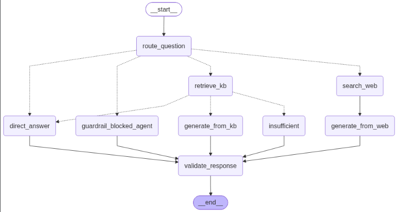
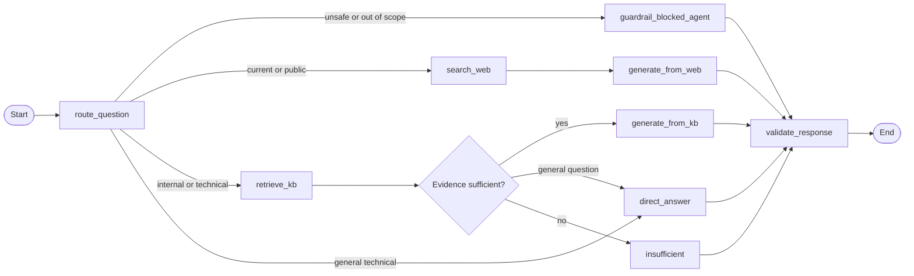

# NexusIQ - Enterprise IT Support Agentic RAG

NexusIQ is a role-aware enterprise IT support copilot. It combines a
professional browser workspace, employee and administrator authentication,
private company knowledge retrieval, grounded answer generation, and
observable LangGraph execution.

The application is split into two services:

| Service | Location | Default port | Responsibility |
| --- | --- | ---: | --- |
| Python RAG and UI service | [`Agentic-RAG/`](./Agentic-RAG/) | `8080` | FastAPI, browser UI, LangGraph workflow, ingestion, Pinecone retrieval, audit logging |
| Node authentication gateway | [Agentic-RAG Backend](<./Agentic-RAG Backend/>) | `3000` | Express API, MongoDB users and conversations, JWT sessions, role enforcement, document gateway |

Supporting project documents are stored in
[`Agentic-RAG/docs/`](./Agentic-RAG/docs/).

## Current user experience

### 1. Public landing page

Unauthenticated visitors first see the NexusIQ landing page. The landing page
is shared by employees and administrators and includes:

- NexusIQ product and enterprise IT support positioning.
- A modern responsive layout for desktop and mobile.
- A workflow intelligence preview using the current LangGraph diagram.
- `Authenticate` buttons in the header and primary hero area.

The landing page is public and does not expose workspace data.

### 2. Authentication

Selecting `Authenticate` opens the role-based authentication screen. Users can
select:

- **Employee** - sign in or create an employee account.
- **Admin** - sign in to administrator capabilities.

The authentication screen includes a responsive `Back to landing` control on
desktop and mobile. Successful authentication redirects users to the
appropriate dashboard route:

- `/employee/dashboard`
- `/admin/dashboard`

An existing valid JWT session skips the authentication screen and opens the
workspace directly. Signing out returns the user to the public landing page.

### 3. Employee workspace

Employees can:

- Ask IT support questions in the chat workspace.
- View their recent conversations.
- Review shared company documents.
- Inspect the latest agent trace and evidence status.
- Explore the LangGraph workflow and knowledge-base behavior.
- Switch between dark and light themes.

Employees cannot upload documents or create administrators.

### 4. Administrator workspace

Administrators can do everything employees can do, plus:

- Upload approved PDF, TXT, Markdown, and DOCX documents.
- Index documents into the private Pinecone knowledge base.
- View indexed document metadata.
- Create additional administrator accounts.
- View the administrator list.

Administrative actions are protected by both the authenticated admin role in
the Node gateway and the shared RAG admin key used for Python ingestion.

## Agent workflow



The current workflow is implemented in
[`workflow.py`](./Agentic-RAG/app/rag/workflow.py). It follows this path:

1. **Route question** - classifies the request and applies safety and scope
   guardrails.
2. **Guardrail blocked agent** - returns a safe response for unsafe or
   unrelated requests.
3. **Retrieve KB** - searches approved internal company documents.
4. **Grade evidence** - checks whether approved evidence is sufficient.
5. **Generate from KB** - generates a response from verified internal evidence.
6. **Search web** - researches current or public information with Tavily.
7. **Generate from web** - labels answers based on external guidance.
8. **Direct answer** - handles general technical questions without claiming
   company policy.
9. **Insufficient** - abstains when internal policy cannot be verified.
10. **Validate response** - validates the response schema, source type,
    citations, and evidence status before returning it.



### Answer modes

| `source_used` | Behavior |
| --- | --- |
| `private_kb` | Uses approved internal documents and returns internal citations |
| `web_search` | Uses Tavily for current/public information and labels citations external |
| `direct` | Answers general technical questions without claiming company policy |
| `insufficient_evidence` | Refuses to invent internal policy and recommends approved IT support |
| `guardrail_blocked` | Returns a safe response for unsafe or unrelated input |

The evidence gate is intentionally conservative. Vector similarity alone is
not treated as proof. Retrieved documents are de-duplicated, and verified
internal answers use only documents marked as approved internal sources.

## Architecture

```text
Browser
  |
  | public landing page, auth flow, employee/admin workspace
  v
Python FastAPI UI :8080
  |
  | authenticated browser API calls
  v
Node Express gateway :3000
  |                         \
  | JWT, roles, MongoDB       \ authenticated RAG request
  v                            v
MongoDB                  Python RAG API
                               |
                 +-------------+--------------+
                 |                            |
            Pinecone KB                    Groq LLM
                 |                            |
                 +--------- Tavily -----------+
                               |
                         SQLite audit DB
```

## Main capabilities

- Public landing page before authentication.
- Responsive desktop and mobile UI.
- Employee registration and login.
- Administrator login and administrator creation.
- Bcrypt password hashing.
- JWT-based sessions with `employee` and `admin` roles.
- Role-specific dashboards and navigation.
- Conversation persistence in MongoDB.
- Shared company document listing for authenticated users.
- Admin-only PDF, TXT, Markdown, and DOCX ingestion.
- 25 MB gateway upload limit and extension allow-list.
- Recursive document chunking with 900-character chunks and 120-character
  overlap.
- Gemini embeddings stored in Pinecone.
- Groq structured answer generation.
- Tavily fallback for current or public questions.
- Safety and out-of-domain guardrails.
- Pydantic response and citation validation.
- Privacy-aware SQLite audit records.
- Optional LangSmith tracing and evaluation.
- Agent trace, source status, workflow view, observability view, and theme
  controls.
- Current workflow image served from
  [`static/langgraph-workflow.png`](./Agentic-RAG/static/langgraph-workflow.png).

## Repository structure

```text
Enterprise agent/
├── README.md
├── Agentic-RAG/
│   ├── app/
│   │   ├── api/                 # FastAPI RAG routes
│   │   ├── core/                # Settings, logging, observability
│   │   ├── evaluation/          # Evaluation dataset and evaluators
│   │   ├── rag/                 # LangGraph workflow and vector store
│   │   └── services/            # Ingestion and audit services
│   ├── data/
│   │   ├── sample_kb/           # Example internal documents
│   │   └── audit.db             # Local SQLite audit database
│   ├── docs/                    # Project reference material
│   ├── scripts/                 # Evaluation and dataset commands
│   ├── static/
│   │   ├── css/style.css        # UI styling
│   │   ├── js/app.js            # UI state, auth, chat, workspace views
│   │   └── langgraph-workflow.png
│   ├── templates/index.html     # Landing, auth, and workspace shell
│   ├── tests/                   # Python tests
│   ├── .env.example
│   ├── Dockerfile
│   ├── requirements.txt
│   └── run.py
└── Agentic-RAG Backend/
    ├── src/
    │   ├── middleware/          # JWT authentication and role checks
    │   ├── routes/              # Auth, admin, documents, questions, chats
    │   ├── config.js
    │   ├── db.js
    │   └── server.js
    ├── .env.example
    ├── package.json
    └── package-lock.json
```

## Prerequisites

- Python 3.11 or newer in the supported project environment.
- Node.js 18 or newer.
- MongoDB.
- Pinecone account and API key.
- Google API key for Gemini embeddings.
- Groq API key for answer generation.
- Tavily API key for current/public questions.
- Optional LangSmith account and API key.

## Quick start on Windows

The commands below assume the repository is located at
`D:\Enterprise agent`.

### 1. Configure the Python service

```powershell
cd "D:\Enterprise agent\Agentic-RAG"
py -3.11 -m venv myenv
.\myenv\Scripts\Activate.ps1
pip install -r requirements.txt
Copy-Item .env.example .env
```

Set at least these values in `Agentic-RAG/.env`:

```dotenv
GROQ_API_KEY=...
GOOGLE_API_KEY=...
PINECONE_API_KEY=...
ADMIN_API_KEY=use-a-long-random-value
```

### 2. Configure the Node backend

Start MongoDB, then open another PowerShell terminal:

```powershell
cd "D:\Enterprise agent\Agentic-RAG Backend"
Copy-Item .env.example .env
npm install
```

Configure:

```dotenv
MONGODB_URI=mongodb://127.0.0.1:27017
MONGODB_DB=enterprise_it_rag
JWT_SECRET=use-a-long-random-secret
RAG_ADMIN_API_KEY=the-same-value-as-python-ADMIN_API_KEY
ADMIN_EMAIL=admin@company.com
ADMIN_PASSWORD=use-a-temporary-password
CLIENT_ORIGIN=http://127.0.0.1:8080
```

Run the backend:

```powershell
npm run dev
```

The backend seeds the configured administrator account on first startup.

### 3. Start the Python service

In another terminal:

```powershell
cd "D:\Enterprise agent\Agentic-RAG"
.\myenv\Scripts\python.exe run.py
```

Open [http://127.0.0.1:8080](http://127.0.0.1:8080). The browser UI starts on
the public landing page and calls the Node gateway at
`BACKEND_API_URL=http://127.0.0.1:3000`.

### 4. Index the sample knowledge base

```powershell
cd "D:\Enterprise agent\Agentic-RAG"
.\myenv\Scripts\python.exe ingest_sample_kb.py
```

This loads `data/sample_kb/`, chunks the documents, creates embeddings, and
writes vectors to the configured Pinecone index and namespace.

## Configuration

### Python service

The complete template is [`Agentic-RAG/.env.example`](./Agentic-RAG/.env.example).

| Variable group | Variables |
| --- | --- |
| LLM | `GROQ_API_KEY`, `GROQ_MODEL` |
| Embeddings | `GOOGLE_API_KEY`, `EMBEDDING_MODEL` |
| Search | `TAVILY_API_KEY` |
| Vector store | `PINECONE_API_KEY`, `PINECONE_INDEX_NAME`, `PINECONE_NAMESPACE`, `TOP_K` |
| Gateway integration | `BACKEND_API_URL`, `ADMIN_API_KEY` |
| Storage | `AUDIT_DB_PATH`, `UPLOAD_DIR`, `SAMPLE_KB_DIR` |
| Observability | `LANGSMITH_TRACING`, `LANGSMITH_API_KEY`, `LANGSMITH_PROJECT`, `LANGSMITH_ENDPOINT` |
| Privacy | `OBSERVABILITY_REDACT_INPUTS`, `OBSERVABILITY_REDACT_RETRIEVED_TEXT`, `OBSERVABILITY_REDACTION_PLACEHOLDER` |

### Node backend

The complete template is
[Agentic-RAG Backend/.env.example](<./Agentic-RAG Backend/.env.example>).

| Variable | Purpose |
| --- | --- |
| `PORT` | Express server port, default `3000` |
| `MONGODB_URI` | MongoDB connection string |
| `MONGODB_DB` | MongoDB database name |
| `JWT_SECRET` | Secret used to sign JWTs |
| `JWT_EXPIRES_IN` | JWT lifetime, default `8h` |
| `RAG_API_URL` | Python RAG service URL |
| `RAG_ADMIN_API_KEY` | Must match Python `ADMIN_API_KEY` |
| `ADMIN_EMAIL` | Seed administrator email |
| `ADMIN_PASSWORD` | Seed administrator password |
| `CLIENT_ORIGIN` | Allowed browser origin |

Never commit populated `.env` files or reuse development credentials in
production.

## API reference

### Node gateway

All protected routes require:

```http
Authorization: Bearer <jwt>
```

| Method | Route | Access | Purpose |
| --- | --- | --- | --- |
| `GET` | `/health` | Public | Gateway health |
| `POST` | `/api/auth/register` | Public | Register an employee |
| `POST` | `/api/auth/login` | Public | Login using an optional role |
| `POST` | `/api/auth/employee/login` | Public | Employee login |
| `POST` | `/api/auth/admin/login` | Public | Admin login |
| `GET` | `/api/auth/me` | JWT | Return the current user |
| `GET` | `/api/documents` | JWT | List shared document metadata |
| `POST` | `/api/documents` | Admin JWT | Upload and index a document |
| `POST` | `/api/questions` | JWT | Store a question and call the RAG service |
| `GET` | `/api/conversations` | JWT | List the current user's chats |
| `POST` | `/api/conversations` | JWT | Create a conversation |
| `GET` | `/api/conversations/:id` | JWT | Read the current user's messages |
| `GET` | `/api/admin/admins` | Admin JWT | List administrators |
| `POST` | `/api/admin/admins` | Admin JWT | Create an administrator |

The document gateway accepts `PDF`, `TXT`, `Markdown`, and `DOCX` files up to
25 MB.

### Python RAG service

| Method | Route | Access | Purpose |
| --- | --- | --- | --- |
| `GET` | `/` | Public | Serve the landing page and browser application |
| `GET` | `/employee/dashboard` | Public shell | Serve the shared UI route |
| `GET` | `/admin/dashboard` | Public shell | Serve the shared UI route |
| `GET` | `/api/health` | Public | RAG service health |
| `POST` | `/api/chat` | Gateway-facing | Execute the LangGraph workflow |
| `POST` | `/api/ingest` | `X-Admin-Key` | Load, chunk, embed, and index a document |

The browser should use the Node gateway for protected operations. The Python
ingestion endpoint is protected by the `X-Admin-Key` header and is intended
for the gateway or trusted administrative tooling.

## Testing and validation

Run Python tests:

```powershell
cd "D:\Enterprise agent\Agentic-RAG"
.\myenv\Scripts\python.exe -m pytest
```

Run the Node checks:

```powershell
cd "D:\Enterprise agent\Agentic-RAG Backend"
npm run check
```

Check the browser JavaScript syntax:

```powershell
node --check "D:\Enterprise agent\Agentic-RAG\static\js\app.js"
```

Optional evaluation commands:

```powershell
cd "D:\Enterprise agent\Agentic-RAG"
.\myenv\Scripts\python.exe scripts/create_evaluation_dataset.py
.\myenv\Scripts\python.exe scripts/run_evaluations.py
```

## Docker

The Python service includes [`Agentic-RAG/Dockerfile`](./Agentic-RAG/Dockerfile):

```powershell
cd "D:\Enterprise agent\Agentic-RAG"
docker build -t nexusiq-rag .
docker run --rm -p 8080:8080 --env-file .env nexusiq-rag
```

Run the Node gateway separately with a managed MongoDB deployment. Production
deployments should use HTTPS, a managed secret store, a real
`CLIENT_ORIGIN`, persistent audit storage, rate limiting, centralized
logging/metrics, and integration/load/security tests.

## Security and privacy

- Passwords are hashed with bcrypt.
- JWTs are signed with a dedicated secret and checked on protected routes.
- Employee self-registration cannot create an administrator account.
- Administrator routes require both a JWT with the admin role and, for RAG
  ingestion, the shared RAG admin key.
- CORS is restricted to `CLIENT_ORIGIN`.
- Helmet provides baseline security headers in the Node gateway.
- Internal documents are filtered by approved internal metadata before
  verified policy answers are generated.
- Instructions embedded in retrieved evidence cannot override the agent
  prompt.
- Input and retrieved text are redacted from observability metadata by
  default.
- Health endpoints do not expose provider credentials or retrieved content.

Treat uploaded documents, MongoDB user and conversation data, and
`Agentic-RAG/data/audit.db` as sensitive enterprise data. Rotate credentials
immediately if they have been exposed.

## Troubleshooting

| Symptom | Checks |
| --- | --- |
| Landing page loads but authentication fails | Confirm the Node gateway is running on port `3000`, `BACKEND_API_URL` is correct, and `CLIENT_ORIGIN` matches the browser origin |
| Backend will not start | Verify MongoDB is reachable and all required Node variables are set |
| `GOOGLE_API_KEY is missing` | Configure Google credentials in the Python `.env` |
| `GROQ_API_KEY is missing` | Configure the Groq key and check `GROQ_MODEL` |
| Pinecone dimension error | Use an index compatible with the configured Gemini embedding model |
| Upload returns a gateway error | Run both services, verify `RAG_API_URL`, and make sure `RAG_ADMIN_API_KEY` equals Python `ADMIN_API_KEY` |
| Internal answer abstains | Re-index documents into the configured index and namespace and verify approved internal metadata |
| Web fallback fails | Configure `TAVILY_API_KEY` for current or public questions |
| Workflow image is missing | Confirm [`static/langgraph-workflow.png`](./Agentic-RAG/static/langgraph-workflow.png) exists and is served at `/static/langgraph-workflow.png` |

## Project status

The current codebase includes the core landing, authentication, role-based
workspace, grounded retrieval, external fallback, guardrails, document
ingestion, auditability, workflow visualization, and evaluation hooks. No
license file is currently included; add an appropriate license before
redistributing the project.
